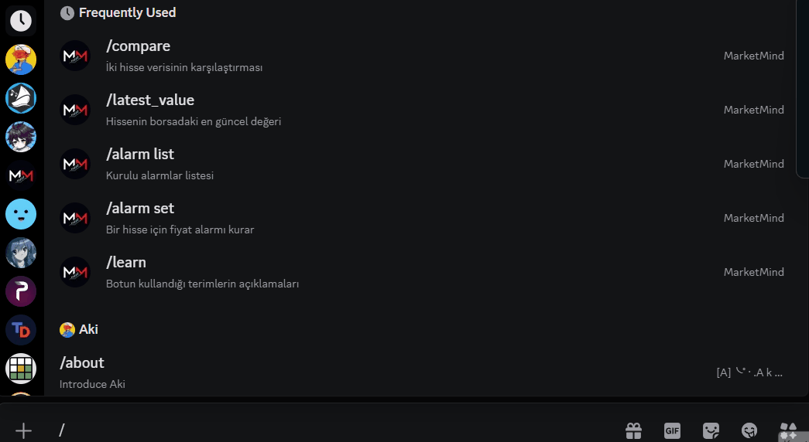

# MarketMind

A Discord bot that explains BIST stock data instead of trading on it. It pulls live prices, computes technical indicators, uses AI to interpret them, and lets you set price alarms for stocks - all without ever giving buy or sell advice

## Demo



## Features

| Command | Description |
|---|---|
| `/latest_value` | Price, daily change, RSI and volume for a single stock. |
| `/index` | Pulls the current value of BIST30 or BIST100. |
| `/compare` | Two stocks side by side, with an optional AI interpret.  |
| `/learn` | Explains the metrics the bot uses in plain language ( RSI, volume ratio). |
| `/alarm set` | Sets a price alarm. Target must be within ±30% of the current price. |
| `/alarm list` | Lists your active alarms(up to 3 per user).  |
| `/alarm delete` | Removes one of your alarms. |

Alarms are checked by a background task every 5 minutes while the market is open —
the bot sends you a DM without any command being run.


## Architecture

```
core/                 # Business logic — no Discord imports
  ai.py               # Gemini prompt layer
  data.py             # yfinance, RSI calculation, 5-minute cache
  database.py         # SQLite (alarms)

MarketMindBot/        # Discord layer
  companies.json      # 611 BIST companies (autocomplete)
  helpers.py          # Formatting helpers
  learn_content.py    # Topic content for /learn
  main.py             # Commands, embeds, views
```

The `core/` package contains no Discord imports. Data fetching, AI prompting and
database access know nothing about how the results are displayed, and the Discord
layer knows nothing about how they are produced.

This is not just file organisation: each core module can be run on its own from the
terminal, without the bot being online. When something breaks, the layer it broke in
is obvious. Porting the bot to another platform would mean rewriting only
`MarketMindBot/`.


## Setup

Requires Python 3.12 or newer.

```bash
git clone https://github.com/Yeglence16/marketmind.git
cd marketmind
python -m venv venv
venv\Scripts\activate          # Windows
pip install -r requirements.txt
```

Create a `.env` file in the project root:

```
DISCORD_TOKEN=your_discord_bot_token
GEMINI_API_KEY=your_gemini_api_key
```

Get your Discord token from the [Developer Portal](https://discord.com/developers/applications)
and your Gemini key from [Google AI Studio](https://aistudio.google.com/apikey).

Run:

```bash
python -m MarketMindBot.main
```

The bot needs the `bot` and `applications.commands` scopes, with permission to send
messages and direct messages.

## Known Limitations

- Market data is delayed by roughly 15 minutes (free yfinance source).
- Public holidays are not checked; only weekends and trading hours are.
- Railway does not use a persistent volume here, so alarms are lost on redeploy.
- The Gemini call is synchronous and blocks the event loop while it runs.

## Roadmap

- Persistent storage for alarms (Railway volume).
- Move the Gemini call off the event loop with `asyncio.to_thread`.
- Portfolio tracking across multiple stocks.

## Disclaimer

MarketMind is an educational project. It does not give buy, sell or hold advice, and
it is not built to support trading decisions. The AI layer is deliberately constrained
to explain what the data shows, never to recommend an action. Nothing the bot outputs
should be treated as financial advice.